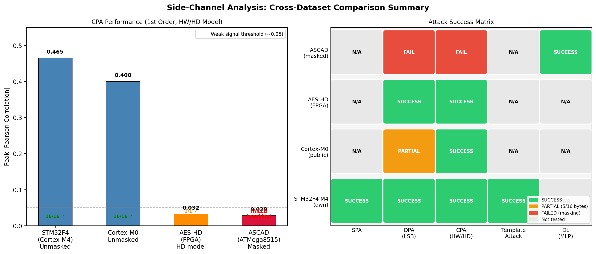

# AES Side-Channel Analysis — Multi-Dataset Study

A practical side-channel analysis (SCA) project targeting AES-128 implementations across four different hardware platforms. The project covers classical attacks (SPA, DPA, CPA, Template Attack) and a deep learning-based attack, demonstrating both successful key recovery and the effect of hardware countermeasures like Boolean masking.

---

## Hardware Setup (Own Dataset)

- **Target board:** ChipWhisperer CW308 with STM32F415 target (ARM Cortex-M4)
- **Measurement:** EM/power side-channel traces captured via oscilloscope
- **AES:** Software AES-128 (no hardware acceleration)
- **Firmware:** Custom C firmware for CW308 (`exp_cortexm4/CW308_AES.py`)

---

## Datasets Tested

| # | Dataset | Device | Core | Countermeasure | Source |
|---|---------|--------|------|----------------|--------|
| 1 | **Cortex-M4** (own) | CW308 + STM32F415 | ARM Cortex-M4 | None | Measured in-lab |
| 2 | **Cortex-M0** | Unknown dev board | ARM Cortex-M0 | None | Zenodo #4742593 |
| 3 | **AES-HD** | Xilinx Virtex-5 FPGA | — | None (HD leakage) | GitHub: gabzai/Methodology-for-efficient-CNN-architectures-in-SCA |
| 4 | **ASCAD** | Atmel ATMega8515 | AVR 8-bit | 1st-order Boolean masking | ANSSI-FR/ASCAD |

> **Note:** Raw dataset files (`.npy`, `.h5`, `.hdf5`) are excluded from this repository due to size.
> The **STM32F4 dataset** (`traces.hdf5`) was collected in-lab and is not publicly distributed — contact the author if you need access.
> All other datasets are publicly available at the links listed above.

---

## Attacks Implemented

### 1. Simple Power Analysis (SPA)
Visual inspection of a single power trace to identify AES round structure. No key recovery — used to understand the leakage model.

**Script:** `exp_cortexm4/main_recovery_spa.py`

### 2. Differential Power Analysis (DPA)
Uses the LSB of the AES S-box output as a 1-bit power prediction. Groups traces by predicted bit and computes the Difference of Means (DoM). A spike in DoM at the correct key candidate reveals the key.

**Script:** `exp_cortexm4/main_recovery_dpa.py`

### 3. Correlation Power Analysis (CPA)
Uses Hamming Weight (HW) of the S-box output as a multi-bit power model. Computes Pearson correlation between predicted and measured power for all 256 key candidates. The highest correlation identifies the correct key byte.

**Script:** `exp_cortexm4/main_recovery_cpa.py`

### 4. Template Attack (TA)
A two-phase profiling attack. Phase 1 builds a multivariate Gaussian template for each possible intermediate value using a known-key device. Phase 2 matches attack traces against the templates using maximum likelihood. The most powerful classical attack when a profiling device is available.

**Script:** `exp_cortexm4/main_recovery_templates.py`

### 5. Deep Learning Attack (DL-MLP)
Uses ANSSI's pre-trained 6-layer MLP (352K parameters) to break Boolean-masked AES where all classical attacks fail. The model was trained on 50,000 profiling traces and outputs a 256-class probability over S-box intermediate values. Key recovery uses accumulated log-likelihood ranking across attack traces.

**Script:** `exp_ascad/main_dl_ascad.py`

---

## Results Summary

### Cross-Dataset Attack Success Matrix



### Detailed Results

#### Dataset 1 — Cortex-M4 (own board, STM32F415)

| Attack | Model | Result | Notes |
|--------|-------|--------|-------|
| SPA | Visual | Trace structure visible | Round boundaries identified |
| DPA | LSB(SBOX[pt⊕k]) | **16/16 bytes** | All subkeys recovered |
| CPA | HW(SBOX[pt⊕k]) | **16/16 bytes** | Peak corr = 0.465 |
| Template | Multivariate Gaussian | **16/16 bytes** | Strongest classical attack |

#### Dataset 2 — ARM Cortex-M0 (public, Zenodo)

| Attack | Model | Result | Notes |
|--------|-------|--------|-------|
| CPA | HW(SBOX[pt⊕k]) | **16/16 bytes** | Key: `CAFEBABE DEADBEAF x2` |
| DPA | LSB(SBOX[pt⊕k]) | **5/16 bytes** | Noisier traces, 1-bit model insufficient |

**M4 vs M0 comparison:** CPA works equally well on both cores (same software AES vulnerability). DPA fails on M0 due to noisier power signal — the 1-bit LSB model requires a cleaner signal than the multi-bit HW model.

#### Dataset 3 — AES-HD FPGA (Xilinx Virtex-5)

| Attack | Model | Result | Notes |
|--------|-------|--------|-------|
| CPA | HD(SBOX_INV[ct⊕k] ⊕ (ct⊕k)) | Key: `0xDF` | Peak corr = 0.032 |
| DPA | LSB of HD | Key: `0x32` | Peak DoM = 0.167 |

**Key insight:** FPGAs leak via **Hamming Distance** (transition between states), not Hamming Weight (absolute value). Even with the correct model the signal is weak — this dataset is designed for deep learning attacks.

#### Dataset 4 — ASCAD Masked AES (ATMega8515)

| Attack | Model | Result | Notes |
|--------|-------|--------|-------|
| CPA | HW(SBOX[pt⊕k]) | **FAILED** | True key corr = 0.028, wrong key wins |
| DPA | LSB(SBOX[pt⊕k]) | **FAILED** | True key DoM = 0.130, wrong key wins |
| **DL MLP** | Pre-trained 6-layer MLP | **SUCCESS** | Rank 0, ~801 traces needed |

**Key insight:** Boolean masking XORs the S-box input with a fresh random mask each trace. This completely destroys the correlation signal for 1st-order attacks. The deep learning model, trained on profiling traces, learns to exploit higher-order leakage that survives masking.

---

## Repository Structure

```
cw-stm32f4-aes-sca/
│
├── exp_cortexm4/                 # STM32F4 own-board experiments (Cortex-M4)
│   ├── main_recovery_spa.py         SPA — single trace visual analysis
│   ├── main_recovery_dpa.py         DPA — 16-byte key recovery
│   ├── main_recovery_cpa.py         CPA — 16-byte key recovery
│   ├── main_recovery_templates.py   Template Attack
│   ├── aes.py                       Pure-Python AES reference implementation
│   ├── CW308_AES.py                 ChipWhisperer firmware interface
│   └── main_measure.py              Oscilloscope trace capture script
│
├── exp_aeshd_hd/                # AES-HD FPGA with HD leakage model
│   ├── main_recovery_cpa_aeshd_hd.py
│   └── main_recovery_dpa_aeshd_hd.py
│
├── exp_cortexm0/                # ARM Cortex-M0 public dataset
│   ├── main_recovery_cpa_cortexm0.py
│   └── main_recovery_dpa_cortexm0.py
│
├── exp_ascad/                   # ASCAD masked AES + deep learning attack
│   ├── main_recovery_cpa_ascad.py   CPA (fails — masking)
│   ├── main_recovery_dpa_ascad.py   DPA (fails — masking)
│   ├── main_dl_ascad.py             DL MLP attack (succeeds)
│   └── aes.py
│
└── results/                     # All output plots
    ├── cross_dataset_comparison.png
    ├── stm32f4/                     SPA, DPA, CPA, Template plots
    ├── cortexm0/                    CPA and DPA plots
    ├── aeshd/                       CPA and DPA plots (HD model)
    └── ascad/                       CPA, DPA, DL score and rank plots
```

---

## How to Run

### Dependencies
```bash
pip install numpy matplotlib h5py tqdm pycryptodome
pip install tensorflow-macos   # Apple Silicon Mac
# or
pip install tensorflow         # Linux / Windows
```

### STM32F4 (own dataset) — requires traces.hdf5 (available on request)
```bash
cd exp_cortexm4
python main_recovery_cpa.py
python main_recovery_dpa.py
python main_recovery_templates.py
```

### Cortex-M0 — download from Zenodo #4742593
```bash
# Place trace_set_10k.npy and plaintext.txt into exp_cortexm0/
cd exp_cortexm0
python main_recovery_cpa_cortexm0.py
python main_recovery_dpa_cortexm0.py
```

### AES-HD FPGA — download from github.com/gabzai/Methodology-for-efficient-CNN-architectures-in-SCA
```bash
# Place AES_HD_dataset/ folder under analysis/
cd exp_aeshd_hd
python main_recovery_cpa_aeshd_hd.py
python main_recovery_dpa_aeshd_hd.py
```

### ASCAD — download ASCAD_data.zip from data.gouv.fr/ASCAD, extract ASCAD.h5 and MLP model
```bash
cd exp_ascad
python main_recovery_cpa_ascad.py    # expected: FAIL
python main_recovery_dpa_ascad.py    # expected: FAIL
python main_dl_ascad.py              # expected: SUCCESS
```

---

## Key Takeaways

1. **CPA outperforms DPA** — the multi-bit Hamming Weight model gives a much stronger signal than the single-bit LSB model, recovering all 16 key bytes reliably on both M4 and M0.

2. **Leakage model must match the hardware** — FPGAs leak via Hamming Distance, not Hamming Weight. Using the wrong model gives completely wrong key candidates.

3. **Boolean masking defeats all 1st-order classical attacks** — on ASCAD, CPA and DPA both fail completely with 10,000 traces. The true key is indistinguishable from random candidates.

4. **Deep learning breaks masking** — ANSSI's pre-trained MLP recovers the correct key byte at rank 0 using ~801 attack traces, exploiting higher-order leakage invisible to classical methods.

5. **M4 vs M0** — both ARM cores running unmasked software AES are equally vulnerable to CPA. DPA is more noise-sensitive and fails on the noisier M0 dataset.

---

## References

- Benadjila et al., *"Study of Deep Learning Techniques for Side-Channel Analysis and Introduction to ASCAD Database"*, ANSSI 2019
- Kocher et al., *"Differential Power Analysis"*, CRYPTO 1999
- Brier et al., *"Correlation Power Analysis with a Leakage Model"*, CHES 2004
- Chari et al., *"Template Attacks"*, CHES 2002
- Zenodo Cortex-M0 dataset: [10.5281/zenodo.4742593](https://doi.org/10.5281/zenodo.4742593)
- AES-HD dataset: [github.com/gabzai/Methodology-for-efficient-CNN-architectures-in-SCA](https://github.com/gabzai/Methodology-for-efficient-CNN-architectures-in-SCA)
- ASCAD: [github.com/ANSSI-FR/ASCAD](https://github.com/ANSSI-FR/ASCAD)
